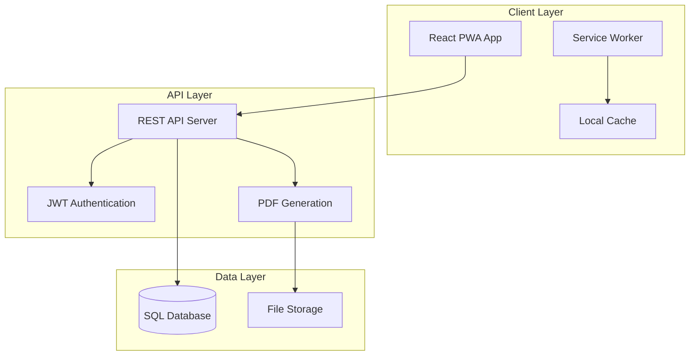
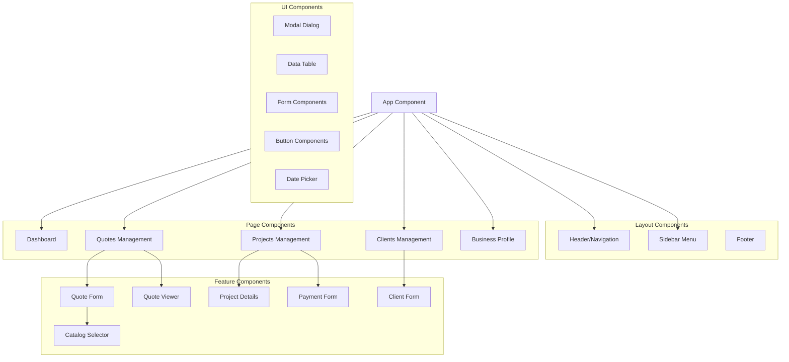
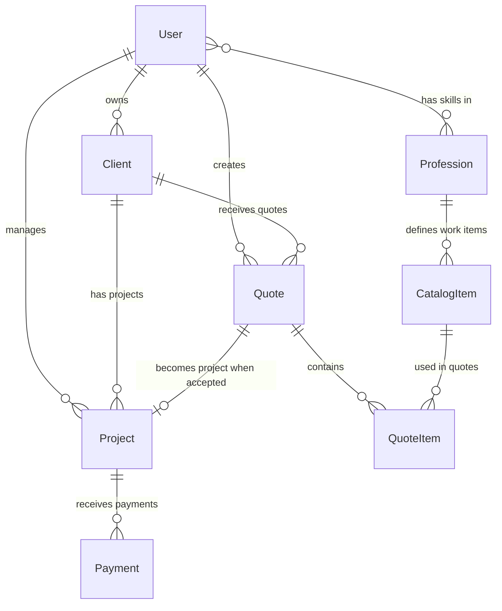

# Design Document

## Overview

Q-Builder is a Progressive Web Application (PWA) designed for construction professionals in Israel. The system follows a modern web architecture with a React frontend and REST API backend, providing comprehensive quote and project management capabilities with full Hebrew/RTL support.

The application uses a single-user tenant model where each registered user manages their own business data independently. The system emphasizes ease of use, mobile responsiveness, and professional document generation with a clean, Apple-inspired design language.

## Design System

### Apple-Inspired Design Language

Q-Builder follows Apple's Human Interface Guidelines adapted for Hebrew/RTL interfaces, emphasizing:

- **Clarity**: Clean typography, ample whitespace, and clear visual hierarchy
- **Deference**: Content takes precedence over interface elements
- **Depth**: Subtle shadows and layering create visual depth without distraction
- **Consistency**: Unified design patterns across all components
- **Accessibility**: High contrast ratios and clear touch targets

### Color Palette

**Primary Colors:**
```css
:root {
  /* Apple-inspired primary colors */
  --color-primary: #007AFF;        /* iOS Blue */
  --color-primary-dark: #0056CC;   /* Darker blue for hover states */
  --color-primary-light: #CCE7FF;  /* Light blue for backgrounds */
  
  /* Secondary colors */
  --color-secondary: #5856D6;      /* iOS Purple */
  --color-success: #34C759;        /* iOS Green */
  --color-warning: #FF9500;        /* iOS Orange */
  --color-error: #FF3B30;          /* iOS Red */
  
  /* Neutral colors */
  --color-gray-50: #F9FAFB;        /* Lightest gray */
  --color-gray-100: #F3F4F6;       /* Very light gray */
  --color-gray-200: #E5E7EB;       /* Light gray */
  --color-gray-300: #D1D5DB;       /* Medium light gray */
  --color-gray-400: #9CA3AF;       /* Medium gray */
  --color-gray-500: #6B7280;       /* Dark medium gray */
  --color-gray-600: #4B5563;       /* Dark gray */
  --color-gray-700: #374151;       /* Very dark gray */
  --color-gray-800: #1F2937;       /* Almost black */
  --color-gray-900: #111827;       /* Black */
  
  /* Background colors */
  --color-background: #FFFFFF;     /* Pure white */
  --color-background-secondary: #F9FAFB; /* Off-white */
  --color-background-tertiary: #F3F4F6;  /* Light gray background */
  
  /* Text colors */
  --color-text-primary: #111827;   /* Primary text */
  --color-text-secondary: #6B7280; /* Secondary text */
  --color-text-tertiary: #9CA3AF;  /* Tertiary text */
}
```

**Dark Mode Support:**
```css
@media (prefers-color-scheme: dark) {
  :root {
    --color-background: #000000;
    --color-background-secondary: #1C1C1E;
    --color-background-tertiary: #2C2C2E;
    --color-text-primary: #FFFFFF;
    --color-text-secondary: #AEAEB2;
    --color-text-tertiary: #8E8E93;
  }
}
```

### Typography

**Font System:**
```css
:root {
  /* Hebrew-optimized font stack */
  --font-family-primary: 'SF Pro Display', 'Rubik', 'Heebo', -apple-system, BlinkMacSystemFont, sans-serif;
  --font-family-secondary: 'SF Pro Text', 'Rubik', 'Heebo', -apple-system, BlinkMacSystemFont, sans-serif;
  --font-family-mono: 'SF Mono', 'Fira Code', 'Courier New', monospace;
  
  /* Font sizes following Apple's type scale */
  --font-size-xs: 0.75rem;    /* 12px */
  --font-size-sm: 0.875rem;   /* 14px */
  --font-size-base: 1rem;     /* 16px */
  --font-size-lg: 1.125rem;   /* 18px */
  --font-size-xl: 1.25rem;    /* 20px */
  --font-size-2xl: 1.5rem;    /* 24px */
  --font-size-3xl: 1.875rem;  /* 30px */
  --font-size-4xl: 2.25rem;   /* 36px */
  --font-size-5xl: 3rem;      /* 48px */
  
  /* Font weights */
  --font-weight-light: 300;
  --font-weight-normal: 400;
  --font-weight-medium: 500;
  --font-weight-semibold: 600;
  --font-weight-bold: 700;
  --font-weight-black: 900;
  
  /* Line heights */
  --line-height-tight: 1.25;
  --line-height-normal: 1.5;
  --line-height-relaxed: 1.75;
}
```

**Typography Classes:**
```css
/* Heading styles */
.text-display {
  font-family: var(--font-family-primary);
  font-size: var(--font-size-5xl);
  font-weight: var(--font-weight-bold);
  line-height: var(--line-height-tight);
  letter-spacing: -0.025em;
}

.text-title-1 {
  font-family: var(--font-family-primary);
  font-size: var(--font-size-4xl);
  font-weight: var(--font-weight-bold);
  line-height: var(--line-height-tight);
}

.text-title-2 {
  font-family: var(--font-family-primary);
  font-size: var(--font-size-3xl);
  font-weight: var(--font-weight-semibold);
  line-height: var(--line-height-tight);
}

.text-title-3 {
  font-family: var(--font-family-primary);
  font-size: var(--font-size-2xl);
  font-weight: var(--font-weight-semibold);
  line-height: var(--line-height-normal);
}

/* Body text styles */
.text-body {
  font-family: var(--font-family-secondary);
  font-size: var(--font-size-base);
  font-weight: var(--font-weight-normal);
  line-height: var(--line-height-normal);
}

.text-body-emphasis {
  font-family: var(--font-family-secondary);
  font-size: var(--font-size-base);
  font-weight: var(--font-weight-semibold);
  line-height: var(--line-height-normal);
}

.text-caption {
  font-family: var(--font-family-secondary);
  font-size: var(--font-size-sm);
  font-weight: var(--font-weight-normal);
  line-height: var(--line-height-normal);
  color: var(--color-text-secondary);
}
```

### Spacing System

**Spacing Scale:**
```css
:root {
  /* Apple's 8-point grid system */
  --spacing-0: 0;
  --spacing-1: 0.25rem;   /* 4px */
  --spacing-2: 0.5rem;    /* 8px */
  --spacing-3: 0.75rem;   /* 12px */
  --spacing-4: 1rem;      /* 16px */
  --spacing-5: 1.25rem;   /* 20px */
  --spacing-6: 1.5rem;    /* 24px */
  --spacing-8: 2rem;      /* 32px */
  --spacing-10: 2.5rem;   /* 40px */
  --spacing-12: 3rem;     /* 48px */
  --spacing-16: 4rem;     /* 64px */
  --spacing-20: 5rem;     /* 80px */
  --spacing-24: 6rem;     /* 96px */
}
```

### Component Design System

**Button Components:**
```css
/* Primary button - Apple style */
.btn-primary {
  background: var(--color-primary);
  color: white;
  border: none;
  border-radius: 12px;
  padding: var(--spacing-3) var(--spacing-6);
  font-family: var(--font-family-secondary);
  font-size: var(--font-size-base);
  font-weight: var(--font-weight-semibold);
  cursor: pointer;
  transition: all 0.2s ease;
  min-height: 44px; /* Apple's minimum touch target */
  
  &:hover {
    background: var(--color-primary-dark);
    transform: translateY(-1px);
    box-shadow: 0 4px 12px rgba(0, 122, 255, 0.3);
  }
  
  &:active {
    transform: translateY(0);
    box-shadow: 0 2px 8px rgba(0, 122, 255, 0.3);
  }
  
  &:disabled {
    background: var(--color-gray-300);
    cursor: not-allowed;
    transform: none;
    box-shadow: none;
  }
}

/* Secondary button */
.btn-secondary {
  background: var(--color-background);
  color: var(--color-primary);
  border: 1px solid var(--color-gray-300);
  border-radius: 12px;
  padding: var(--spacing-3) var(--spacing-6);
  font-family: var(--font-family-secondary);
  font-size: var(--font-size-base);
  font-weight: var(--font-weight-semibold);
  cursor: pointer;
  transition: all 0.2s ease;
  min-height: 44px;
  
  &:hover {
    background: var(--color-gray-50);
    border-color: var(--color-primary);
    transform: translateY(-1px);
    box-shadow: 0 4px 12px rgba(0, 0, 0, 0.1);
  }
}

/* Destructive button */
.btn-destructive {
  background: var(--color-error);
  color: white;
  border: none;
  border-radius: 12px;
  padding: var(--spacing-3) var(--spacing-6);
  font-family: var(--font-family-secondary);
  font-size: var(--font-size-base);
  font-weight: var(--font-weight-semibold);
  cursor: pointer;
  transition: all 0.2s ease;
  min-height: 44px;
  
  &:hover {
    background: #E60000;
    transform: translateY(-1px);
    box-shadow: 0 4px 12px rgba(255, 59, 48, 0.3);
  }
}
```

**Card Components:**
```css
.card {
  background: var(--color-background);
  border-radius: 16px;
  padding: var(--spacing-6);
  box-shadow: 0 1px 3px rgba(0, 0, 0, 0.1), 0 1px 2px rgba(0, 0, 0, 0.06);
  border: 1px solid var(--color-gray-200);
  transition: all 0.2s ease;
  
  &:hover {
    box-shadow: 0 4px 6px rgba(0, 0, 0, 0.07), 0 2px 4px rgba(0, 0, 0, 0.06);
    transform: translateY(-1px);
  }
}

.card-header {
  margin-bottom: var(--spacing-4);
  padding-bottom: var(--spacing-4);
  border-bottom: 1px solid var(--color-gray-200);
}

.card-title {
  font-family: var(--font-family-primary);
  font-size: var(--font-size-xl);
  font-weight: var(--font-weight-semibold);
  color: var(--color-text-primary);
  margin: 0;
}

.card-subtitle {
  font-family: var(--font-family-secondary);
  font-size: var(--font-size-sm);
  color: var(--color-text-secondary);
  margin: var(--spacing-1) 0 0 0;
}
```

**Form Components:**
```css
.form-group {
  margin-bottom: var(--spacing-6);
}

.form-label {
  display: block;
  font-family: var(--font-family-secondary);
  font-size: var(--font-size-sm);
  font-weight: var(--font-weight-semibold);
  color: var(--color-text-primary);
  margin-bottom: var(--spacing-2);
}

.form-input {
  width: 100%;
  padding: var(--spacing-3) var(--spacing-4);
  border: 1px solid var(--color-gray-300);
  border-radius: 12px;
  font-family: var(--font-family-secondary);
  font-size: var(--font-size-base);
  background: var(--color-background);
  color: var(--color-text-primary);
  transition: all 0.2s ease;
  min-height: 44px;
  
  &:focus {
    outline: none;
    border-color: var(--color-primary);
    box-shadow: 0 0 0 3px rgba(0, 122, 255, 0.1);
  }
  
  &::placeholder {
    color: var(--color-text-tertiary);
  }
  
  &:disabled {
    background: var(--color-gray-100);
    color: var(--color-text-tertiary);
    cursor: not-allowed;
  }
}

.form-error {
  color: var(--color-error);
  font-size: var(--font-size-sm);
  margin-top: var(--spacing-1);
}
```

**Navigation Components:**
```css
.navbar {
  background: rgba(255, 255, 255, 0.8);
  backdrop-filter: blur(20px);
  border-bottom: 1px solid var(--color-gray-200);
  padding: var(--spacing-4) 0;
  position: sticky;
  top: 0;
  z-index: 100;
}

.sidebar {
  background: var(--color-background);
  border-left: 1px solid var(--color-gray-200); /* RTL: border-left instead of border-right */
  width: 280px;
  height: 100vh;
  position: fixed;
  right: 0; /* RTL: right instead of left */
  top: 0;
  padding: var(--spacing-6);
  overflow-y: auto;
}

.nav-item {
  display: flex;
  align-items: center;
  padding: var(--spacing-3) var(--spacing-4);
  border-radius: 12px;
  color: var(--color-text-primary);
  text-decoration: none;
  transition: all 0.2s ease;
  margin-bottom: var(--spacing-1);
  
  &:hover {
    background: var(--color-gray-100);
  }
  
  &.active {
    background: var(--color-primary-light);
    color: var(--color-primary);
    font-weight: var(--font-weight-semibold);
  }
}

.nav-icon {
  width: 20px;
  height: 20px;
  margin-left: var(--spacing-3); /* RTL: margin-left instead of margin-right */
}
```

**Table Components:**
```css
.table {
  width: 100%;
  border-collapse: collapse;
  background: var(--color-background);
  border-radius: 12px;
  overflow: hidden;
  box-shadow: 0 1px 3px rgba(0, 0, 0, 0.1);
}

.table th {
  background: var(--color-gray-50);
  padding: var(--spacing-4);
  text-align: right; /* RTL */
  font-family: var(--font-family-secondary);
  font-size: var(--font-size-sm);
  font-weight: var(--font-weight-semibold);
  color: var(--color-text-secondary);
  border-bottom: 1px solid var(--color-gray-200);
}

.table td {
  padding: var(--spacing-4);
  text-align: right; /* RTL */
  border-bottom: 1px solid var(--color-gray-200);
  font-family: var(--font-family-secondary);
  font-size: var(--font-size-base);
  color: var(--color-text-primary);
}

.table tr:hover {
  background: var(--color-gray-50);
}
```

**Modal Components:**
```css
.modal-overlay {
  position: fixed;
  top: 0;
  left: 0;
  right: 0;
  bottom: 0;
  background: rgba(0, 0, 0, 0.5);
  display: flex;
  align-items: center;
  justify-content: center;
  z-index: 1000;
  backdrop-filter: blur(4px);
}

.modal {
  background: var(--color-background);
  border-radius: 20px;
  padding: var(--spacing-8);
  max-width: 500px;
  width: 90%;
  max-height: 80vh;
  overflow-y: auto;
  box-shadow: 0 25px 50px rgba(0, 0, 0, 0.25);
  transform: scale(0.95);
  animation: modalEnter 0.2s ease forwards;
}

@keyframes modalEnter {
  to {
    transform: scale(1);
  }
}

.modal-header {
  margin-bottom: var(--spacing-6);
  text-align: center;
}

.modal-title {
  font-family: var(--font-family-primary);
  font-size: var(--font-size-2xl);
  font-weight: var(--font-weight-bold);
  color: var(--color-text-primary);
  margin: 0;
}

.modal-actions {
  display: flex;
  gap: var(--spacing-3);
  justify-content: flex-end;
  margin-top: var(--spacing-8);
}
```

### RTL-Specific Styles

**RTL Layout System:**
```css
[dir="rtl"] {
  direction: rtl;
  text-align: right;
}

/* RTL-specific component adjustments */
[dir="rtl"] .sidebar {
  right: 0;
  left: auto;
  border-right: 1px solid var(--color-gray-200);
  border-left: none;
}

[dir="rtl"] .nav-icon {
  margin-right: 0;
  margin-left: var(--spacing-3);
}

[dir="rtl"] .table th,
[dir="rtl"] .table td {
  text-align: right;
}

[dir="rtl"] .table th:first-child,
[dir="rtl"] .table td:first-child {
  text-align: right;
}

/* RTL form layouts */
[dir="rtl"] .form-input {
  text-align: right;
}

[dir="rtl"] .checkbox-label {
  flex-direction: row-reverse;
}

[dir="rtl"] .radio-label {
  flex-direction: row-reverse;
}
```

### Animation System

**Micro-interactions:**
```css
/* Smooth transitions for all interactive elements */
* {
  transition-property: background-color, border-color, color, fill, stroke, opacity, box-shadow, transform;
  transition-duration: 0.2s;
  transition-timing-function: cubic-bezier(0.4, 0, 0.2, 1);
}

/* Loading animations */
@keyframes spin {
  from { transform: rotate(0deg); }
  to { transform: rotate(360deg); }
}

.loading-spinner {
  animation: spin 1s linear infinite;
}

/* Fade in animation */
@keyframes fadeIn {
  from { opacity: 0; transform: translateY(10px); }
  to { opacity: 1; transform: translateY(0); }
}

.fade-in {
  animation: fadeIn 0.3s ease forwards;
}

/* Slide in animation for mobile menus */
@keyframes slideInRight {
  from { transform: translateX(100%); }
  to { transform: translateX(0); }
}

.slide-in-right {
  animation: slideInRight 0.3s ease forwards;
}
```

### Responsive Design

**Breakpoint System:**
```css
:root {
  /* Apple device breakpoints */
  --breakpoint-sm: 390px;   /* iPhone 12 Pro */
  --breakpoint-md: 768px;   /* iPad Mini */
  --breakpoint-lg: 1024px;  /* iPad Pro */
  --breakpoint-xl: 1280px;  /* Desktop */
  --breakpoint-2xl: 1536px; /* Large Desktop */
}

/* Mobile-first responsive utilities */
@media (min-width: 390px) {
  .sm\:hidden { display: none; }
  .sm\:block { display: block; }
}

@media (min-width: 768px) {
  .md\:hidden { display: none; }
  .md\:block { display: block; }
  .md\:flex { display: flex; }
  .md\:grid { display: grid; }
}

@media (min-width: 1024px) {
  .lg\:hidden { display: none; }
  .lg\:block { display: block; }
}
```

### Accessibility

**Focus Management:**
```css
/* Custom focus styles */
*:focus {
  outline: none;
  box-shadow: 0 0 0 3px rgba(0, 122, 255, 0.3);
  border-radius: 4px;
}

/* Skip link for keyboard navigation */
.skip-link {
  position: absolute;
  top: -40px;
  left: 6px;
  background: var(--color-primary);
  color: white;
  padding: 8px;
  text-decoration: none;
  border-radius: 4px;
  z-index: 1000;
}

.skip-link:focus {
  top: 6px;
}

/* Screen reader only content */
.sr-only {
  position: absolute;
  width: 1px;
  height: 1px;
  padding: 0;
  margin: -1px;
  overflow: hidden;
  clip: rect(0, 0, 0, 0);
  white-space: nowrap;
  border: 0;
}
```

### Icon System

**Icon Guidelines:**
- Use SF Symbols-inspired icons for consistency
- 20x20px for navigation icons
- 24x24px for action buttons
- 16x16px for inline icons
- Maintain 2px stroke width for outline icons

**Icon Implementation:**
```jsx
// Icon component with Apple-style design
const Icon = ({ name, size = 20, color = 'currentColor', ...props }) => {
  return (
    <svg
      width={size}
      height={size}
      viewBox="0 0 24 24"
      fill="none"
      stroke={color}
      strokeWidth="2"
      strokeLinecap="round"
      strokeLinejoin="round"
      {...props}
    >
      {/* Icon paths */}
    </svg>
  );
};
```

## Architecture

### High-Level Architecture



### Technology Stack

**Frontend:**
- React 18 with Vite for fast development and building
- Zustand for lightweight state management
- Tailwind CSS for responsive, RTL-compatible styling
- React Router for client-side navigation
- PWA capabilities with Service Worker for offline functionality
- OAuth integration for Google and Apple Sign-In

**Backend:**
- Node.js with Express.js for REST API
- JWT for stateless authentication
- OAuth 2.0 integration (Google, Apple)
- PDF generation library (PDFKit with Hebrew font support)
- Multer for file upload handling (logos)
- CSV parsing for catalog seed data

**Database:**
- PostgreSQL or MySQL for relational data storage
- Proper indexing for performance optimization
- Foreign key constraints for data integrity
- Database seeding scripts for professions and catalog items

**Infrastructure:**
- Kiro Cloud managed hosting environment
- HTTPS for secure communication
- CORS configuration for cross-origin requests
- File storage for business logos and documents

## Components and Interfaces

### Frontend Components Architecture



### State Management Structure

```javascript
// Zustand Store Structure
{
  // Authentication State
  auth: {
    user: User | null,
    token: string | null,
    isAuthenticated: boolean
  },
  
  // Business Data
  clients: Client[],
  quotes: Quote[],
  projects: Project[],
  catalogItems: CatalogItem[],
  
  // UI State
  ui: {
    loading: boolean,
    selectedQuote: Quote | null,
    selectedProject: Project | null,
    modals: {
      clientForm: boolean,
      paymentForm: boolean
    }
  },
  
  // Actions
  actions: {
    // Auth actions
    login: (credentials) => Promise<void>,
    logout: () => void,
    
    // Data actions
    fetchClients: () => Promise<void>,
    createQuote: (quote) => Promise<Quote>,
    updateProject: (id, updates) => Promise<Project>,
    addPayment: (projectId, payment) => Promise<Payment>
  }
}
```

### API Interface Design

**Base URL:** `/api/v1`

**Authentication:**
- All protected endpoints require `Authorization: Bearer <JWT_TOKEN>` header
- JWT contains user ID and expiration time
- Token refresh mechanism for long sessions

**Response Format:**
```javascript
// Success Response
{
  success: true,
  data: any,
  message?: string
}

// Error Response
{
  success: false,
  error: {
    code: string,
    message: string,
    details?: any
  }
}
```

**Key Endpoints:**

```javascript
// Authentication
POST /auth/register
POST /auth/login
POST /auth/oauth/google
POST /auth/oauth/apple
GET /auth/me
PUT /auth/profile

// Clients
GET /clients
POST /clients
GET /clients/:id
PUT /clients/:id
DELETE /clients/:id

// Quotes
GET /quotes
POST /quotes
GET /quotes/:id
PUT /quotes/:id
POST /quotes/:id/accept
POST /quotes/:id/send
GET /quotes/:id/pdf

// Projects
GET /projects
POST /projects
GET /projects/:id
PUT /projects/:id

// Payments
GET /projects/:projectId/payments
POST /projects/:projectId/payments
PUT /payments/:id
DELETE /payments/:id

// Notifications
GET /notifications/settings
PUT /notifications/settings
POST /notifications/test

// Catalog
GET /catalog
GET /catalog/professions
POST /admin/catalog/seed (admin only)
```

## Data Models

### Core Entities

**User/Business Profile:**
```javascript
{
  id: number,
  name: string,
  email: string,
  passwordHash: string?,
  provider: 'local' | 'google' | 'apple',
  providerId: string?,
  emailVerified: boolean,
  businessName: string,
  phone: string,
  address: string,
  logoUrl: string?,
  professionIds: number[],
  vatRate: number, // Default 18% (0.18), configurable for future
  notificationSettings: {
    emailEnabled: boolean,
    quoteExpiry: boolean,
    paymentReminders: boolean,
    quoteSent: boolean
  },
  createdAt: Date,
  updatedAt: Date
}
```

**Profession:**
```javascript
{
  id: number,
  name: string,
  nameHebrew: string,
  createdAt: Date
}
```

**CatalogItem:**
```javascript
{
  id: number,
  professionId: number,
  name: string,
  unit: string,
  defaultPrice: number?,
  description: string?,
  createdAt: Date
}
```

**Client:**
```javascript
{
  id: number,
  userId: number,
  name: string,
  contactPerson: string?,
  phone: string,
  email: string,
  address: string,
  notes: string?,
  createdAt: Date
}
```

**Quote:**
```javascript
{
  id: number,
  userId: number,
  clientId: number,
  projectId: number?,
  quoteNumber: string,
  title: string,
  issueDate: Date,
  expiryDate: Date,
  status: 'draft' | 'sent' | 'accepted' | 'rejected' | 'expired',
  totalAmount: number,
  currency: string,
  terms: string?,
  items: QuoteItem[],
  createdAt: Date,
  updatedAt: Date
}
```

**QuoteItem:**
```javascript
{
  id: number,
  quoteId: number,
  catalogItemId: number?,
  description: string,
  unit: string,
  quantity: number,
  unitPrice: number,
  lineTotal: number
}
```

**Project:**
```javascript
{
  id: number,
  userId: number,
  clientId: number,
  originQuoteId: number?,
  name: string,
  description: string?,
  status: 'active' | 'completed' | 'cancelled',
  startDate: Date,
  endDate: Date?,
  budget: number,
  payments: Payment[],
  createdAt: Date
}
```

**Payment:**
```javascript
{
  id: number,
  projectId: number,
  date: Date,
  amount: number,
  method: string,
  note: string?,
  receiptNumber: string?
}
```

### Database Schema Relationships



## Error Handling

### Frontend Error Handling

**Error Boundary Component:**
```javascript
class ErrorBoundary extends React.Component {
  // Catches JavaScript errors in component tree
  // Displays fallback UI
  // Logs errors for debugging
}
```

**API Error Handling:**
```javascript
// Centralized error handling in API service
const handleApiError = (error) => {
  if (error.response?.status === 401) {
    // Redirect to login
    authStore.logout();
  } else if (error.response?.status >= 500) {
    // Show system error message
    showNotification('System error occurred', 'error');
  } else {
    // Show specific error message
    showNotification(error.response?.data?.error?.message, 'error');
  }
};
```

### Backend Error Handling

**Error Middleware:**
```javascript
const errorHandler = (err, req, res, next) => {
  // Log error details
  logger.error(err);
  
  // Determine error type and response
  if (err.name === 'ValidationError') {
    return res.status(400).json({
      success: false,
      error: {
        code: 'VALIDATION_ERROR',
        message: 'Invalid input data',
        details: err.details
      }
    });
  }
  
  // Default server error
  res.status(500).json({
    success: false,
    error: {
      code: 'INTERNAL_ERROR',
      message: 'Internal server error'
    }
  });
};
```

**Input Validation:**
- Use Joi or similar library for request validation
- Validate all user inputs before processing
- Sanitize data to prevent injection attacks

## Testing Strategy

### Frontend Testing

**Unit Testing:**
- Jest and React Testing Library for component testing
- Test individual components in isolation
- Mock external dependencies and API calls
- Focus on user interactions and state changes

**Integration Testing:**
- Test component interactions and data flow
- Test API integration with mock servers
- Verify state management across components

**E2E Testing:**
- Cypress or Playwright for end-to-end testing
- Test critical user journeys (create quote, manage project)
- Test PWA functionality and offline capabilities

### Backend Testing

**Unit Testing:**
- Jest for testing individual functions and modules
- Test business logic and data transformations
- Mock database operations

**Integration Testing:**
- Test API endpoints with real database
- Test authentication and authorization
- Test PDF generation functionality

**Database Testing:**
- Test data integrity and constraints
- Test complex queries and relationships
- Test migration scripts

### Testing Scenarios

**Critical User Flows:**
1. User registration and login
2. Create quote with catalog items
3. Convert quote to project
4. Add payments to project
5. Generate and download PDF
6. Offline functionality and sync

**Edge Cases:**
- Large quotes with many line items
- Expired quotes handling
- Concurrent user sessions
- Network connectivity issues
- File upload failures

## RTL and Hebrew Support Implementation

### CSS and Layout

**Tailwind RTL Configuration:**
```javascript
// tailwind.config.js
module.exports = {
  content: ['./src/**/*.{js,jsx}'],
  theme: {
    extend: {
      fontFamily: {
        'hebrew': ['Rubik', 'Arial', 'sans-serif']
      }
    }
  },
  plugins: [
    require('@tailwindcss/forms'),
    require('tailwindcss-rtl')
  ]
}
```

**RTL Layout Classes:**
```css
.rtl {
  direction: rtl;
  text-align: right;
}

.rtl .sidebar {
  right: 0;
  left: auto;
}

.rtl .table th:first-child {
  text-align: right;
}
```

### PDF Generation with Hebrew Support

**PDF Template Structure:**
Based on the reference sample PDF, the quote document should include:
1. Business logo (top-left corner)
2. Business contact information block
3. Client information block (right-aligned)
4. Quote header with quote number and dates
5. Items table with Hebrew headers and RTL alignment
6. Totals section with subtotal and VAT calculations
7. Terms and conditions section
8. Signature area and footer

**PDF Configuration:**
```javascript
const generateHebrewPDF = (quoteData) => {
  const doc = new PDFDocument({
    font: 'fonts/NotoSansHebrew-Regular.ttf',
    layout: 'portrait',
    margins: { top: 50, bottom: 50, left: 50, right: 50 }
  });
  
  // Set RTL text direction
  doc.bidi = true;
  
  // Add business logo (top-left)
  if (quoteData.businessLogo) {
    doc.image(quoteData.businessLogo, 50, 50, { width: 100 });
  }
  
  // Business info block (top-right, RTL aligned)
  doc.text(quoteData.businessName, 400, 50, { align: 'right' });
  doc.text(quoteData.businessAddress, 400, 70, { align: 'right' });
  doc.text(quoteData.businessPhone, 400, 90, { align: 'right' });
  
  // Client block
  doc.text('לכבוד:', 50, 150, { align: 'right' });
  doc.text(quoteData.clientName, 50, 170, { align: 'right' });
  
  // Quote header
  doc.text(`הצעת מחיר מספר: ${quoteData.quoteNumber}`, 50, 220, { align: 'right' });
  
  // Items table with RTL layout
  generateItemsTable(doc, quoteData.items);
  
  return doc;
};
```

### Quote and Project Numbering

**Numbering Format:**
- Quotes: `Q-<YEAR>-<SEQ4>` (e.g., `Q-2025-0001`)
- Projects: `P-<YEAR>-<SEQ4>` (e.g., `P-2025-0001`)
- Sequential numbering per user, reset annually

**Implementation:**
```javascript
const generateQuoteNumber = async (userId) => {
  const currentYear = new Date().getFullYear();
  const lastQuote = await Quote.findOne({
    where: { userId, quoteNumber: { [Op.like]: `Q-${currentYear}-%` } },
    order: [['createdAt', 'DESC']]
  });
  
  const nextSequence = lastQuote 
    ? parseInt(lastQuote.quoteNumber.split('-')[2]) + 1 
    : 1;
    
  return `Q-${currentYear}-${nextSequence.toString().padStart(4, '0')}`;
};
```

### Catalog Seeding Implementation

**Initial Professions List:**
The system will seed the following professions on first deployment:
- חשמל (Electrical)
- אינסטלציה (Plumbing) 
- צבע (Painting)
- גבס (Drywall)
- ריצוף (Flooring)
- פירוק ופינוי (Demolition and Cleanup)
- עבודות אלומיניום (Aluminum Work)
- גינות (Gardening)
- מטבחים (Kitchens)
- טיח (Plastering)
- גגות (Roofing)
- איטום (Waterproofing)
- שלד (Framework)
- מסגרות (Frames)
- מיזוג אוויר (Air Conditioning)
- דודי שמש (Solar Water Heaters)
- גז (Gas)
- נגרות ודלתות (Carpentry and Doors)
- הנדימן (Handyman)

**CSV Import Structure:**
```javascript
// Sample CSV format for catalog items
// profession_name,item_name,unit,default_price,description
// חשמל,התקנת נקודת חשמל,יחידה,150,התקנת שקע או מתג חשמל
// חשמל,החלפת לוח חשמל,יחידה,800,החלפת לוח חשמל ביתי

const seedCatalogFromCSV = async () => {
  const professions = await seedProfessions();
  
  for (const profession of professions) {
    const csvPath = `./seeds/catalog_${profession.name}.csv`;
    const catalogItems = await parseCSV(csvPath);
    
    for (const item of catalogItems) {
      await CatalogItem.create({
        professionId: profession.id,
        name: item.item_name,
        unit: item.unit,
        defaultPrice: parseFloat(item.default_price) || null,
        description: item.description
      });
    }
  }
};
```

### OAuth Authentication Implementation

**OAuth Flow Design:**
```javascript
// OAuth callback handling
const handleOAuthCallback = async (provider, profile) => {
  let user = await User.findOne({
    where: { 
      provider,
      providerId: profile.id 
    }
  });
  
  if (!user) {
    // Create new user from OAuth profile
    user = await User.create({
      name: profile.displayName,
      email: profile.emails[0].value,
      provider,
      providerId: profile.id,
      emailVerified: true,
      businessName: profile.displayName, // Default, user can update
      professionIds: [] // User will select during onboarding
    });
  }
  
  // Generate JWT token
  const token = jwt.sign(
    { userId: user.id, email: user.email },
    process.env.JWT_SECRET,
    { expiresIn: '7d' }
  );
  
  return { user, token };
};
```

**Frontend OAuth Integration:**
```javascript
// Google Sign-In component
const GoogleSignIn = () => {
  const handleGoogleLogin = () => {
    window.location.href = '/api/auth/oauth/google';
  };
  
  return (
    <button onClick={handleGoogleLogin} className="oauth-button">
      <GoogleIcon />
      התחבר עם Google
    </button>
  );
};

// Apple Sign-In component  
const AppleSignIn = () => {
  const handleAppleLogin = () => {
    window.location.href = '/api/auth/oauth/apple';
  };
  
  return (
    <button onClick={handleAppleLogin} className="oauth-button">
      <AppleIcon />
      התחבר עם Apple
    </button>
  );
};
```

## Security Considerations

### Authentication Security
- JWT tokens with reasonable expiration times (7 days)
- Secure password hashing with bcrypt for local accounts
- OAuth 2.0 secure flow implementation for Google/Apple
- Rate limiting on authentication endpoints
- HTTPS enforcement
- Secure OAuth redirect URI validation

### Data Security
- Input validation and sanitization
- SQL injection prevention with parameterized queries
- XSS prevention with proper output encoding
- CSRF protection for state-changing operations

### File Upload Security
- File type validation for logo uploads
- File size limits
- Virus scanning for uploaded files
- Secure file storage with access controls

## Performance Optimization

### Frontend Performance
- Code splitting with React.lazy()
- Image optimization and lazy loading
- Service Worker for caching strategies
- Bundle size optimization

### Backend Performance
- Database indexing on frequently queried fields
- Connection pooling for database connections
- Caching for catalog items and user profiles
- Pagination for large data sets

### PWA Optimization
- Efficient caching strategies
- Background sync for offline operations
- Push notifications for important updates
- App shell architecture for fast loading

## VAT Calculation System

### VAT Rate Configuration
The system uses a configurable VAT rate stored in the user profile, defaulting to 18% for Israeli market compliance.

**VAT Calculation Implementation:**
```javascript
// VAT calculation utilities
const calculateVAT = (amount, vatRate = 0.18) => {
  return amount * vatRate;
};

const calculateTotalWithVAT = (subtotal, vatRate = 0.18) => {
  const vatAmount = calculateVAT(subtotal, vatRate);
  return {
    subtotal,
    vatAmount,
    total: subtotal + vatAmount
  };
};

// Quote totals calculation
const calculateQuoteTotals = (items, vatRate) => {
  const subtotal = items.reduce((sum, item) => sum + item.lineTotal, 0);
  return calculateTotalWithVAT(subtotal, vatRate);
};
```

**PDF VAT Display:**
```javascript
// VAT section in PDF generation
const addVATSection = (doc, totals) => {
  const y = 400; // Position after items table
  
  doc.text('סכום ביניים:', 400, y, { align: 'right' });
  doc.text(`₪${totals.subtotal.toFixed(2)}`, 300, y, { align: 'right' });
  
  doc.text('מע"מ 18%:', 400, y + 20, { align: 'right' });
  doc.text(`₪${totals.vatAmount.toFixed(2)}`, 300, y + 20, { align: 'right' });
  
  doc.text('סה"כ כולל מע"מ:', 400, y + 40, { align: 'right', fontSize: 14 });
  doc.text(`₪${totals.total.toFixed(2)}`, 300, y + 40, { align: 'right', fontSize: 14 });
};
```

## Notification System

### Email Notification Architecture

**Email Service Configuration:**
```javascript
// Email service setup with Nodemailer
const nodemailer = require('nodemailer');

const emailTransporter = nodemailer.createTransporter({
  host: process.env.SMTP_HOST,
  port: process.env.SMTP_PORT,
  secure: true,
  auth: {
    user: process.env.SMTP_USER,
    pass: process.env.SMTP_PASS
  }
});

// Email templates for different notification types
const emailTemplates = {
  quoteSent: {
    subject: 'הצעת מחיר נשלחה - Q-Builder',
    template: 'quote-sent-notification'
  },
  quoteExpiring: {
    subject: 'הצעת מחיר עומדת לפוג - Q-Builder',
    template: 'quote-expiring-reminder'
  },
  paymentReminder: {
    subject: 'תזכורת תשלום - Q-Builder',
    template: 'payment-reminder'
  }
};
```

**Notification Service Implementation:**
```javascript
class NotificationService {
  async sendQuoteSentNotification(quote, client, user) {
    if (!user.notificationSettings.quoteSent) return;
    
    // Send to business owner
    await this.sendEmail({
      to: user.email,
      subject: `הצעת מחיר ${quote.quoteNumber} נשלחה`,
      template: 'quote-sent-business',
      data: { quote, client, user }
    });
    
    // Send to client
    if (client.email) {
      await this.sendEmail({
        to: client.email,
        subject: `הצעת מחיר מ${user.businessName}`,
        template: 'quote-sent-client',
        data: { quote, client, user }
      });
    }
  }
  
  async sendQuoteExpiryReminder(quote, user) {
    if (!user.notificationSettings.quoteExpiry) return;
    
    await this.sendEmail({
      to: user.email,
      subject: `הצעת מחיר ${quote.quoteNumber} עומדת לפוג`,
      template: 'quote-expiring',
      data: { quote, user }
    });
  }
  
  async sendPaymentReminder(project, user, client) {
    if (!user.notificationSettings.paymentReminders) return;
    
    const balance = this.calculateProjectBalance(project);
    if (balance <= 0) return;
    
    await this.sendEmail({
      to: user.email,
      subject: `תזכורת תשלום - פרויקט ${project.name}`,
      template: 'payment-reminder',
      data: { project, user, client, balance }
    });
  }
}
```

**Scheduled Notification Jobs:**
```javascript
// Cron jobs for automated notifications
const cron = require('node-cron');

// Check for expiring quotes daily at 9 AM
cron.schedule('0 9 * * *', async () => {
  const expiringQuotes = await Quote.findAll({
    where: {
      status: 'sent',
      expiryDate: {
        [Op.between]: [
          new Date(),
          new Date(Date.now() + 3 * 24 * 60 * 60 * 1000) // 3 days from now
        ]
      }
    },
    include: [User, Client]
  });
  
  for (const quote of expiringQuotes) {
    await notificationService.sendQuoteExpiryReminder(quote, quote.User);
  }
});

// Check for payment reminders weekly
cron.schedule('0 9 * * 1', async () => {
  const completedProjects = await Project.findAll({
    where: { status: 'completed' },
    include: [User, Client, Payment]
  });
  
  for (const project of completedProjects) {
    const balance = calculateProjectBalance(project);
    if (balance > 0) {
      await notificationService.sendPaymentReminder(project, project.User, project.Client);
    }
  }
});
```

### Notification Settings Management

**Frontend Notification Settings Component:**
```javascript
const NotificationSettings = () => {
  const [settings, setSettings] = useState({
    emailEnabled: true,
    quoteSent: true,
    quoteExpiry: true,
    paymentReminders: true
  });
  
  const handleSettingChange = (key, value) => {
    setSettings(prev => ({ ...prev, [key]: value }));
  };
  
  const saveSettings = async () => {
    await api.put('/notifications/settings', settings);
    showNotification('הגדרות התראות נשמרו', 'success');
  };
  
  return (
    <div className="notification-settings">
      <h3>הגדרות התראות</h3>
      
      <div className="setting-item">
        <label>
          <input
            type="checkbox"
            checked={settings.emailEnabled}
            onChange={(e) => handleSettingChange('emailEnabled', e.target.checked)}
          />
          הפעל התראות דוא"ל
        </label>
      </div>
      
      <div className="setting-item">
        <label>
          <input
            type="checkbox"
            checked={settings.quoteSent}
            onChange={(e) => handleSettingChange('quoteSent', e.target.checked)}
          />
          התראה כאשר הצעה נשלחה
        </label>
      </div>
      
      <div className="setting-item">
        <label>
          <input
            type="checkbox"
            checked={settings.quoteExpiry}
            onChange={(e) => handleSettingChange('quoteExpiry', e.target.checked)}
          />
          תזכורת לפני פקיעת הצעה
        </label>
      </div>
      
      <div className="setting-item">
        <label>
          <input
            type="checkbox"
            checked={settings.paymentReminders}
            onChange={(e) => handleSettingChange('paymentReminders', e.target.checked)}
          />
          תזכורות תשלום
        </label>
      </div>
      
      <button onClick={saveSettings}>שמור הגדרות</button>
    </div>
  );
};
```